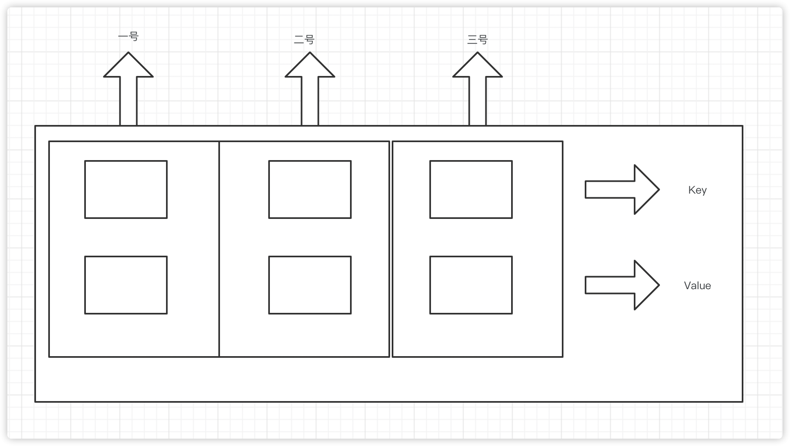

# HashMap

## HashMap的数据结构是什么？

HashMap的底层数据结构是数组加链表的形式。

------

## HashMap的扩容机制

------

## 头插和尾插

------

## HashMap是线程安全的么？如何保证线程安全

------

HashMap不是线程安全的，有三种方法，第一种，使用HashTable,第二种，使用Collections.synchronizedMap(new HashMap<>())，第三种，使用ConcurrentHashMap.