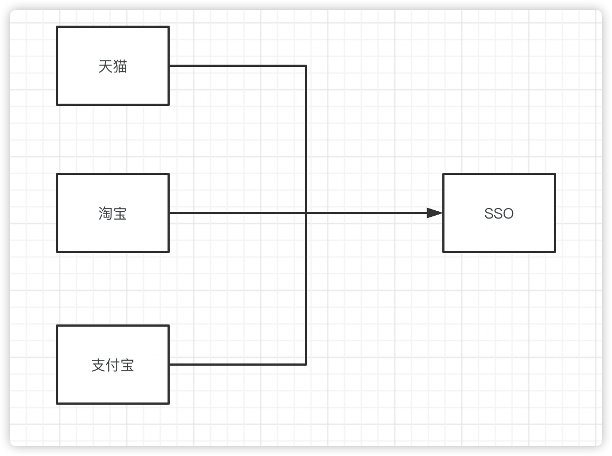

# 单点登录

## 1.什么是单点登录

单点登录的英文名全称是Single Sign On, 其实就是当业务发展的比较好，各系统之间的登录都交给了SSO来做，各系统之间都可以互相信任。比如一个公司旗下的多种产品，登录过一个以后，登录其他的只需要看他有没有在SSO中登录过。如果登录过，则信任它。

------

## 2.同域下的SSO

什么是同域下面的SSO呢？比如现在你的company有一个顶级域名top.com，这个时候，你有两个应用，一个叫做application1.top.com,另外一个叫做application2.top.com，还有一个是我们的SSO系统，比如它的域名是sso.top.com. 我们都知道，对于cookie来说，他只能携带当前应用的域名的cookie信息。那么application1.top.com和application2.top.com怎么才能得到server设置过来的cookie的呢？这个就很有意思，cookie还有一个特性就是，虽然不同的域名，但是可以放到顶级域名中。这个时候，因为application1.top.com,application2.top.com,sso.top.com都是属于顶级域名top.com的子系统，所以他们都可以从顶级域名中来取到cookie。这样就解决跨域的问题。但是application1和application2是不同的系统，虽然我们在SSO登录了，但是session在不同的系统，这个时候我们怎么判断当前的session是有效的呢？这个时候就用到了session集中式存储的方法，比如spring-session还有我们可以用redis也可以解决这个分布式session的问题。

------

## 3.不同域下的SSO

1. 用户访问app系统，app系统是需要登录的，但用户现在没有登录。
2. 跳转到SSO登录系统。SSO系统也没有登录，弹出用户登录页。
3. 用户填写用户名、密码，SSO系统进行认证后，将登录状态写入SSO的session，浏览器（Browser）中写入SSO域下的Cookie。
4. SSO系统登录完成后会生成一个ST（Service Ticket），然后跳转到app系统，同时将ST作为参数传递给app系统。
5. app系统拿到ST后，从后台向SSO发送请求，验证ST是否有效。
6. 验证通过后，app系统将登录状态写入session并设置app域下的Cookie。

至此，跨域单点登录就完成了。以后我们再访问app系统时，app就是登录的。接下来，我们再看看访问app2系统时的流程。

1. 用户访问app2系统，app2系统没有登录，跳转到SSO。
2. 由于SSO已经登录了，不需要重新登录认证。
3. SSO生成ST，浏览器跳转到app2系统，并将ST作为参数传递给app2。
4. app2拿到ST，后台访问SSO，验证ST是否有效。
5. 验证成功后，app2将登录状态写入session，并在app2域下写入Cookie。

这样，app2系统不需要走登录流程，就已经是登录了。SSO，app和app2在不同的域，它们之间的session不共享也是没问题的。